---
## Author
author:
  name: Седохин Даниил Алеквсеевич

## Title
title: "Лабораторная работа"
subtitle: "Номер 1"
license: "CC BY"
---

# Цель работы

Основной целью работы является развёртывание в системе виртуализации
(например, в VirtualBox) mininet, знакомство с основными командами для работы с Mininet через командную строку и через графический интерфейс.

# Выполнение лабораторной работы

Скачаем образ виртуальной машины с репозитория гитхаба.
(рис. [-@fig-001]).

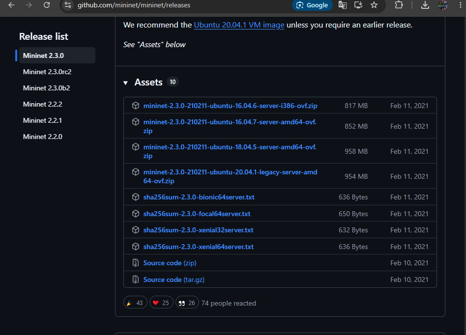{#fig-001}

Импортируем образ ВМ и вносим конфигурации
(рис. [-@fig-002]).

{#fig-002}

Залогиньтесь в виртуальной машине:

– login: mininet

– password: mininet

– Посмотрите адрес машины:

1 ifconfig

– Внутренний адрес машины будет иметь вид 192.168.x.y.

– Подключитесь к виртуальной машине (из терминала хостовой машины):

1 ssh -Y mininet@192.168.x.y

– Для отключения ssh-соединения с виртуальной машиной нажмите Ctrl + d .

– Настройте ssh-подсоединение по ключу к виртуальной машине, для чего
в терминале основной Linux-машины перейдите в каталог .ssh своего домашнего каталога и введите 
(вместо 192.168.x.y укажите внутренний адрес
виртуальной машины Mininet):
(рис. [-@fig-003]).

{#fig-003}

Для отключения ssh-соединения с виртуальной машиной нажмите Ctrl + d .

– Настройте ssh-подсоединение по ключу к виртуальной машине, для чего
в терминале основной Linux-машины перейдите в каталог .ssh своего домашнего каталога и введите (вместо 192.168.x.y укажите внутренний адрес

виртуальной машины Mininet):
1 ssh-copy-id mininet@192.168.x.y

– Вновь подключитесь к виртуальной машине и убедитесь, что подсоединение
происходит успешно и без ввода пароля.
(рис. [-@fig-004]).

{#fig-004}

После подключения к виртуальной машине mininet посмотрите IP-адреса
машины:

1 ifconfig

– Для доступа к сети Интернет должен быть активен адрес NAT: 10.0.0.x.

– Если активен только внутренний адрес машины вида 192.168.x.y, то активируйте второй интерфейс, набрав в командной строке:
1 sudo dhclient eth1
2 ifconfig
(рис. [-@fig-005]).

{#fig-005}

– Для удобства дальнейшей работы установите mc:
1 sudo apt install mc
(рис. [-@fig-006]).

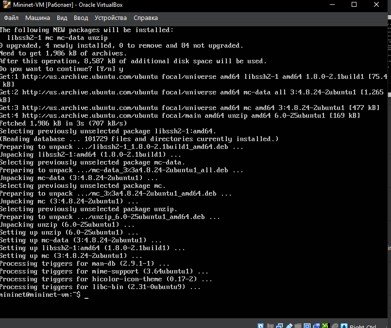{#fig-006}

Для удобства дальнейшей работы добавьте для mininet указание на использование двух адаптеров при запуске. Для этого требуется перейти
в режим суперпользователя и внести изменения в файл /etc/netplan/01-
netcfg.yaml виртуальной машины mininet:
1 sudo mcedit /etc/netplan/01-netcfg.yaml
– В результате файл /etc/netplan/01-netcfg.yaml должен иметь следующий вид:

1 network:

2 version: 2

3 renderer: networkd

4 ethernets:

5 eth0:

6 dhcp4: yes

7 eth1:

8 dhcp4: yes
(рис. [-@fig-007]).

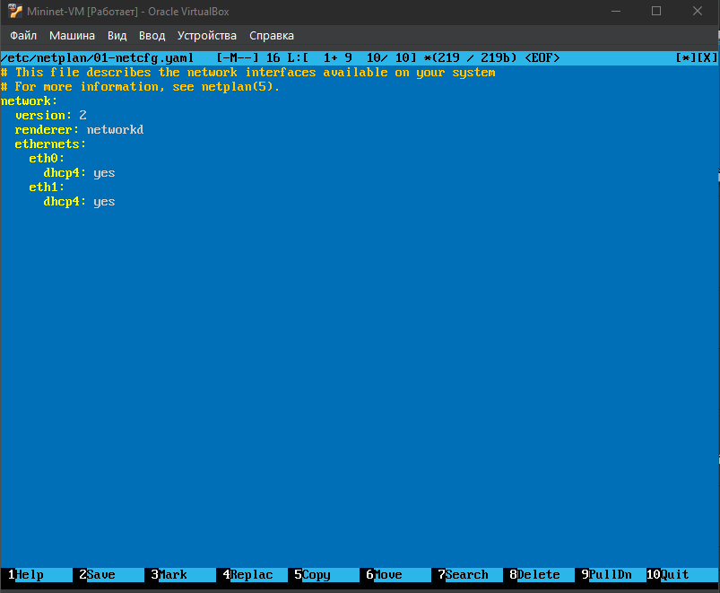{#fig-006}

В виртуальной машине mininet переименуйте предыдущую установку Mininet:
1 mv ~/mininet ~/mininet.orig
– Скачайте новую версию Mininet:

1 cd ~

2 git clone https://github.com/mininet/mininet.git
– Обновите исполняемые файлы:

1 cd ~/mininet

2 sudo make install
– Проверьте номер установленной версии mininet:

1 mn --version
(рис. [-@fig-008]).

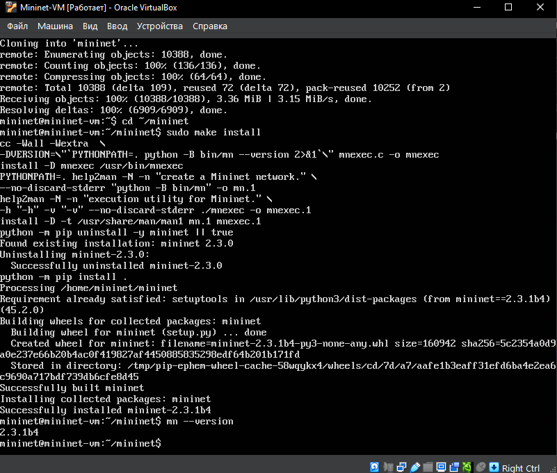{#fig-006}

По умолчанию XTerm использует растровые шрифты малого кегля. Для увеличения размера шрифта и применения векторных шрифтов вместо растровых
необходимо внести изменения в файл /etc/X11/app-defaults/XTerm. Для
этого можно воспользоваться следующей командой:
1 sudo mcedit /etc/X11/app-defaults/XTerm
и затем в конце файла добавить строки:

1 xterm*faceName: Monospace

2 xterm*faceSize: 12
Здесь выбран системный моноширинный шрифт, кегль шрифта — 12 пунктов.
(рис. [-@fig-009]).

{#fig-006}

Установка программного обеспечения.
– Установите putty:

1 choco install putty

– Установите VcXsrv Windows X Server:

1 choco install vcxsrv
(рис. [-@fig-010]).

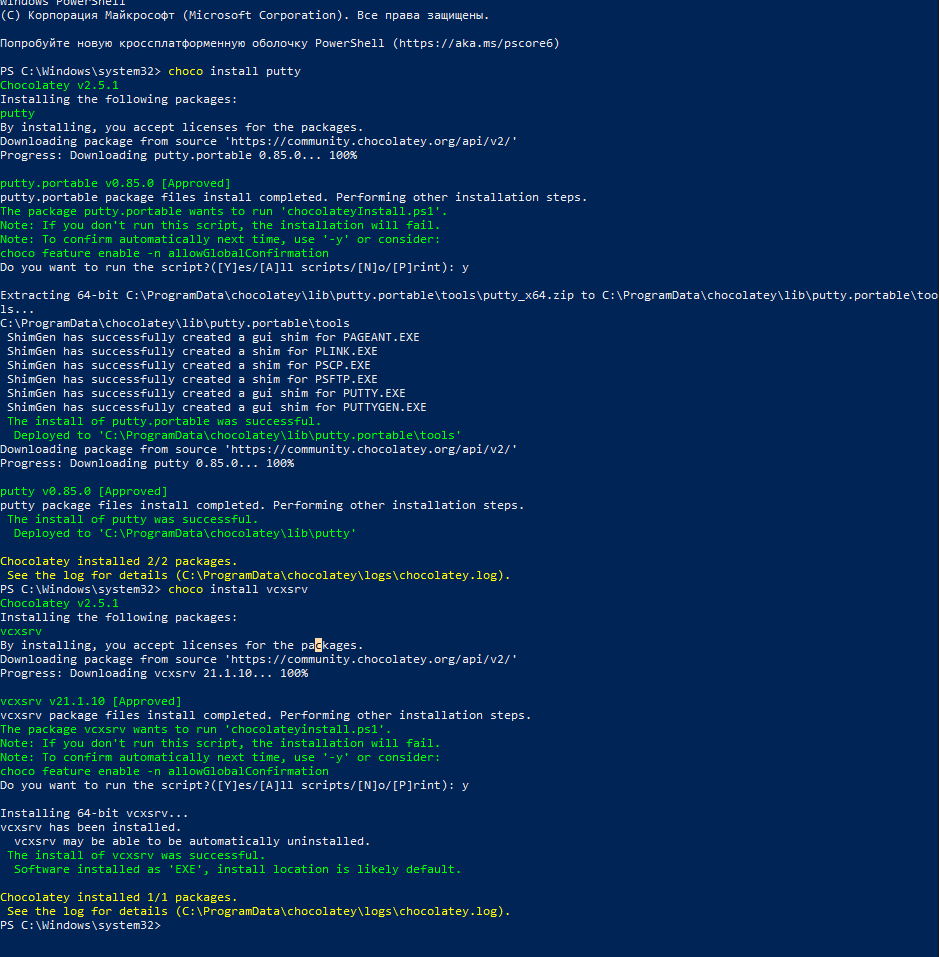{#fig-006}

Запуск Xserver
(рис. [-@fig-011]).

{#fig-006}

Запуск Xserver
(рис. [-@fig-012]).

{#fig-006}

Запуск putty. При подключении добавьте опцию перенаправления X11:
– Connection SSH X11 : Enable X11 forwarding
(рис. [-@fig-013]).

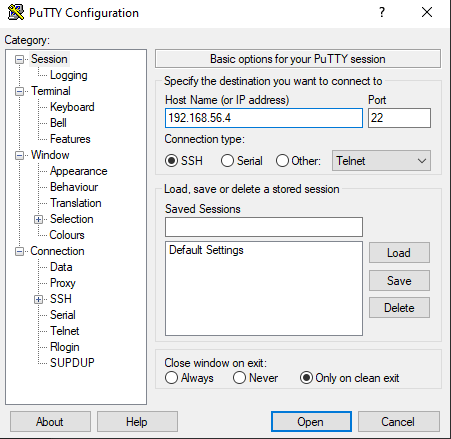{#fig-006}

Настройка соединения X11 для суперпользователя
(рис. [-@fig-014]).

{#fig-006}

Вызов Mininet с использованием топологии по умолчанию.
– Для запуска минимальной топологии введите в командной строке:

1 sudo mn

Эта команда запускает Mininet с минимальной топологией, состоящей из
коммутатора, подключённого к двум хостам.

– Для отображения списка команд интерфейса командной строки Mininet
и примеров их использования введите команду в интерфейсе командной
строки Mininet:

1 help

(рис. [-@fig-015]).

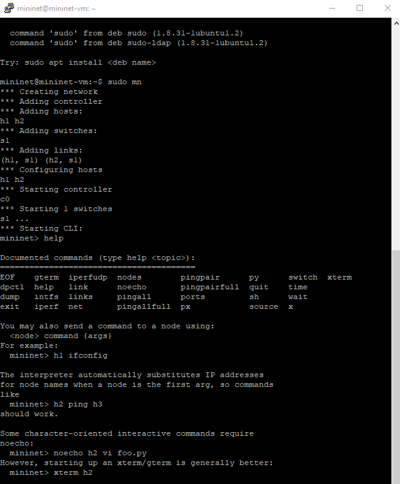{#fig-006}

Отображение доступных узлов и их связей
(рис. [-@fig-016]).

{#fig-006}

Просмотр интерфейсов на первом хосте
(рис. [-@fig-017]).

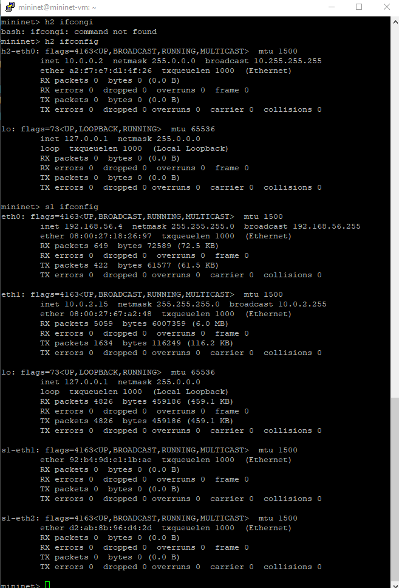{#fig-006}

Проверка связности
(рис. [-@fig-018]).

{#fig-006}

Построение и эмуляция сети в Mininet с использованием
графического интерфейса
(рис. [-@fig-019]).

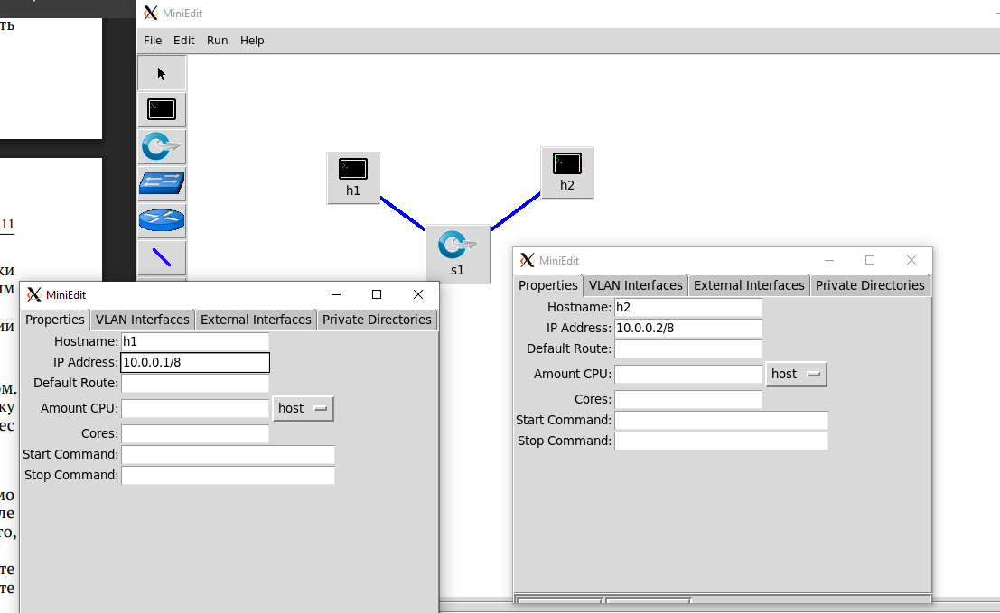{#fig-006}

Проверка связности.
(рис. [-@fig-020]).

{#fig-006}

Автоматическое назначение IP-адресов.
(рис. [-@fig-021]).

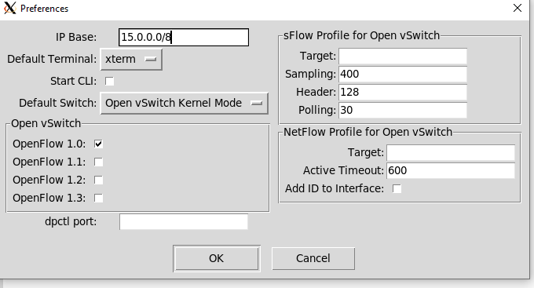{#fig-006}

Проверка автоматического назначения адресов
(рис. [-@fig-022]).

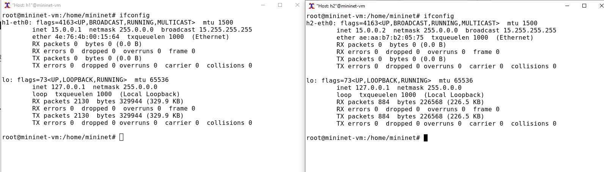{#fig-006}

Сохранение и загрузка топологии Mininet.
(рис. [-@fig-023]).

{#fig-006}

# Выводы

Я развернул в системе виртуализации
(например, в VirtualBox) mininet, ознакомился с основными командами для работы с Mininet через командную строку и через графический интерфейс.
